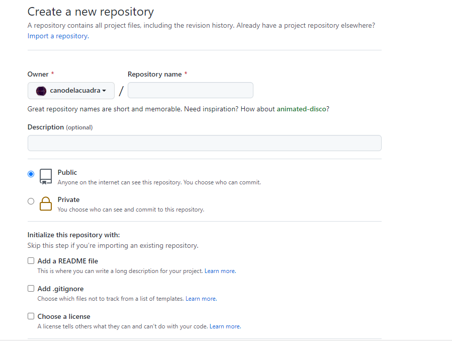
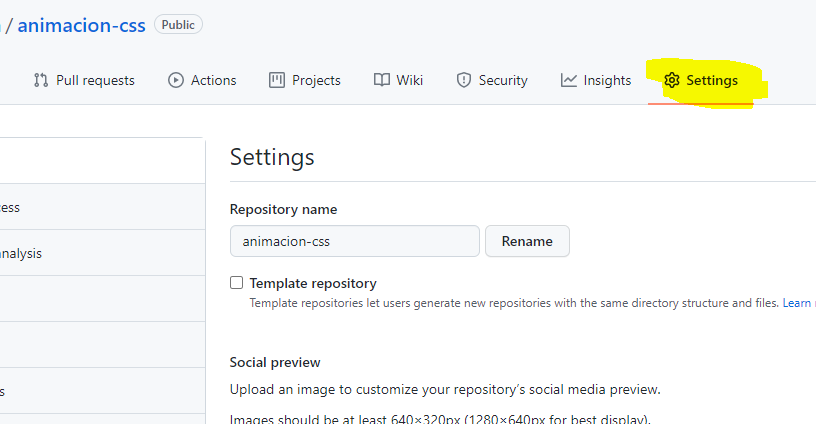
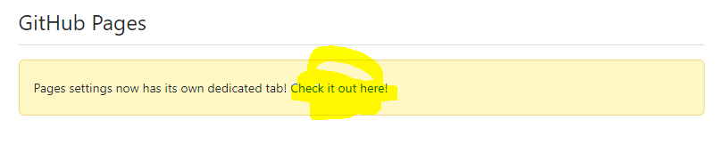
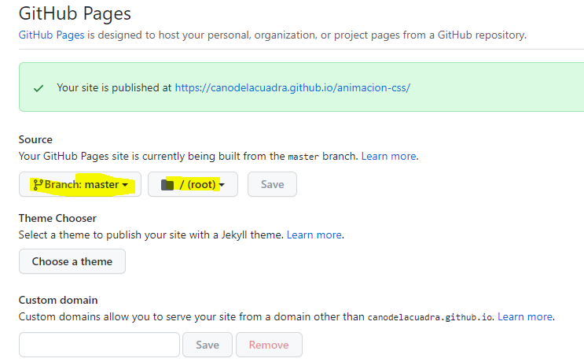
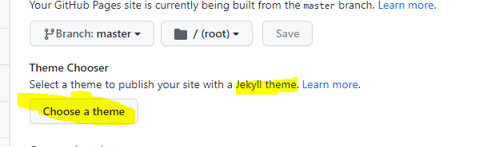

# Github Pages
Github Pages es 
* un servicio de alojamiento de sitio estático que toma archivos HTML, CSS y JavaScript directamente desde un repositorio en GitHub, 
* opcionalmente ejecuta los archivos a través de un proceso de compilación y publica un sitio web. 

Puedes alojar tu sitio en el dominio github.io de GitHub o en tu propio dominio personalizado. 

## Tipos de sitios Github Pages
Existen tres tipos básicos de Github Pages sitios: 
* de proyecto o repositorio, 
* de usuario y 
* de la organización.
 
 Los sitios de proyecto están conectados coon un proyecto específico alojado en GitHub, como una biblioteca JavaScript o una colección de recetas. Los sitios de usuarios y organizaciones están conectados a un usuario específico en GitHub.com
Por ejemplo: ***https://github.com/usuario/*** estaría conectado con  ***usuario.github.io***

* Para publicar un sitio de usuario, debes crear un repositorio que pertenezca a tu cuenta de usuario que se llame ````<username>.github.io````. 
* Para publicar un sitio de organización debes crear un repositorio que pertenezca a una organización y que se llame ````<organization>.github.io````. A menos de que estés utilizando un dominio personalizado, los sitios de usuario y de organización se encuentran disponibles en ````http(s)://<username>.github.io```` o ````http(s)://<organization>.github.io````.
* Los archivos  de código fuente para un sitio de proyecto se almacenan en el mismo repositorio que su proyecto.L os sitios de proyecto se encuentran disponibles en ````http(s)://<username>.github.io/<repository>```` o ````http(s)://<organization>.github.io/<repository>````.


Solo puedes crear un sitio de organización o de usuario para cada cuenta en GitHub. Los sitios de proyectos, ya sean propiedad de una cuenta de organización de de usuario, son ilimitados.

### Publicar fuentes para sitios Fithub Pages
La fuente del cógigo de publicación para tu sitio de Github Pages es la rama y carpeta en donde se almacenan los archivos  de código fuente de tu sitio.

Si la fuente de publicación predeterminada existe en tu repositorio, Github Pages publicará automáticamente un sitio desde esta fuente. La fuente de publicación predeterminada para los sitios de usuario y de organización es la raíz de la rama predeterminada para el repositorio. La fuente de publicación predeterminada para los sitios de proyecto es la raíz de la rama gh-pages.

Si quieres mantener los archivos fuente para tu sitio en una ubicación distinta, puedes cambiar la fuente de publicación para tu sitio. Puedes publicar tu sitio desde cualquier rama en el repositorio, ya sea desde la raíz del repositorio en esa rama, /, o desde la carpeta de /docs en ella. Para obtener más información, consulta "Configurar una fuente de publicación para tu sitio Github Pages".

Si eliges la carpeta de /docs o cualquier rama como tu fuente de publicación, Github Pages leerá toda esta carpeta para publicar tu sitio.

## Generadores de sitios estáticos
Github Pages publica cualquier archivo estático que subas a tu repositorio. Puedes crear tus propios archivos estáticos o usar un generador de sitios estáticos para desarrolloar el  sitio (Vuepress, Gatsby, Hugo...). También puedes personalizar tu propio proceso de compilación de forma local o en otro servidor.Se recomienda Jekyll, un generador de sitio estático que viene integrado en  Github Pages y un proceso de compilación simplificado.

Github Pages usará Jekyll para compilar tu sitio por defecto. Si deseas usar un generador de sitio estático diferente a Jekyll, desactiva el proceso de compilación de Jekyll creando un archivo vacío denominado ``.nojekyll`` en la raíz de tu fuente de publicación, luego seguir las instrucciones del generador de sitio estático para desarrollar tu sitio localmente.

> Github Pages no soporta idiomas del lado del servidor como PHP, Ruby o Python.

## Guías para usar Github Pages
* los sitios Github Pages  se brindan a través de HTTPS. 
* Los sitios Github Pages no se deben usar para realizar transacciones que impliquen el envío de información confidencial como contraseñas o números de tarjeta de crédito. - Tu uso de Github Pages está sujeto a los [Términos del servicio de GitHub](/free-pro-team@latest/github/site-policy/github-terms-of-service/), incluida la prohibición de reventa.
### Límites de uso
los sitios Github Pages están sujetos a los siguientes límites de uso:

* Los repositorios de fuente de Github Pages tienen un límite recomendado de 1 GB. Para más información, consulta "¿Cuál es la cuota de mi disco?"

* Los sitios de Github Pages publicados no pueden ser mayores a 1 GB.

* Los sitios de Github Pages tienen un ancho de banda virtual de 100GB por mes.

* Los sitios de Github Pages tienen un límite virtual de 10 compilaciones por hora.

Si tu sitio excede estas cuotas de uso, es posible que no podamos prestar servicio a tu sitio, o puedes recibir un correo electrónico formal de GitHub Support sugiriendo estrategias para reducir el impacto de tu sitio en nuestros servidores, lo que incluye poner una red de distribución de contenido de un tercero (CDN) al frente de tu sitio, usar las otras características de GitHub, como lanzamientos, o mudar a un servicio de alojamiento diferente que pueda satisfacer mejor tus necesidades.

### Usos prohibidos
Github Pages no pretende ser un servicio de alojamiento web gratuito ni permite que se use de ese modo para realizar tus negocios en línea, un sitio de comercio electrónico, o cualquier otro sitio web que esté principalmente dirigido a facilitar las operaciones comerciales o brindar software comercial como un servicio (SaaS).

Adicionalmente, GitHub no permite que se utilicen las Github Pages para algunos propósitos o actividades específicos. Para encontrar una lista de usos prohibidos, consulta la sección "Condiciones adicionales de producto de GitHub para las Github Pages".

## Crear un sitio de Github Pages

Puede crear un sitio de Github Pages en un repositorio **nuevo o existente**.

 ### Crear un nuevo repositorio para Github Pages
Si tu sitio es un proyecto independiente, puedes crear un repositorio nuevo para almacenar el código fuente del mismo.

Si su sitio está asociado con un proyecto existente, puede agregar el código fuente al repositorio de ese proyecto, en una carpeta denominada  ````/docs```` en la rama predeterminada(master) o en una rama diferente. Por ejemplo, si estás creando un sitio para publicar documentación para un proyecto que ya está en GitHub, podrías querer almacenar el código fuente para este sitio en el mismo repositorio donde se encuentra el proyecto.

> Si quieres crear un sitio en un repositorio existente, salta hasta la sección ***"Crear tu sitio"***.

1. En la esquina superior derecha de cualquier página, utiliza el menú desplegable  y selecciona Repositorio Nuevo.
 
  

2. Utiliza el menú desplegable de Propietario y selecciona la cuenta que quieres sea propietaria del repositorio.

 

3. Escribe un nombre para tu repositorio y una descripción opcional. Si estás creando un sitio de usuario u organización, tu repositorio se debe nombrar ````<user>.github.io```` o ````<organization>.github.io````. Si tu nombre de organización o usuario contiene mayúsculas, debes hacerlas minúsculas. Para obtener más información, consulta la sección "Acerca de Github Pages".
   
4. Crear un campo de repositorio
Elige la visibilidad del repositorio. Si lo pones privado, es una cuenta de pago

5. Selecciona Inicializar este repositorio con un README. (es posible no hacerlo pero por el momento es lo recomendado)(Las otras dos opciones también las dejamos sin marcar por el momento.)

6. Haz clic en Crear repositorio.

### Crear tu sitio de Github Pages
Antes de que puedas crear tu sitio, debes tener un repositorio para el mismo en GitHub. 

En GitHub, navega al repositorio de tu sitio y activa la pestaña settings
 

Busca la sección github pages
 
Entra en la misma
 
Decide desde qué source : rama (master) y  directorio de archivo quieres publicar (o desde la raiz (root) del sitio o desde docs). 

Si ya existe la fuente de publicación que elegiste, desplázate hasta la fuente de publicación. Si la fuente de publicación que elegiste no existe, crear la fuente de publicación.

En la raíz de la fuente de publicación, crea un archivo nuevo denominado index.md que contenga el contenido que quieras mostrar en la página principal de tu sitio.

> Tip:Si index.html está presente, se utilizará en lugar de index.md. Si ni index.html ni index.md están presentes, se utilizará README.md.


Para ver tu sitio publicado, debajo de "Github Pages", da clic en la URL del mismo.
URL de tu sitio publicado

> Nota: Es posible que tome hasta 20 minutos la publicación de los cambios en tu sitio luego de que subes los cambios a GitHub. Si no ves los cambios reflejados en tu buscador después de una hora, consulta la sección "Acerca de los errores de compilación de Jekyll para sitios de Github Pages".

> Nota: Si su sitio no se ha publicado automáticamente, asegúrese de que alguien con permisos de administrador y una dirección de correo electrónico verificada haya enviado a la fuente de publicación

### Añadir Archivos
Puedes agregar más páginas a tu sitio creando más archivos nuevos. Cada archivo estará disponible en tu sitio en la misma estructura de directorios que tu fuente de publicación. Por ejemplo, si la fuente de publicación para tu sitio de proyectos es la rama gh-pages, y creas un archivo nuevo denominado /about/contact-us.md en la rama gh-pages, el archivo estará disponible en ````https://<user>.github.io/<repository>/about/contact-us.html````.
### Usando Jekyll
También puedes agregar un tema para personalizar la apariencia de tu sitio usando jeckyll

 
> Para personalizar aún más tu sitio, puedes usar Jekyll, un generador de sitio estático con soporte integrado para Github Pages. Para obtener más información, consulta la sección "Acerca de Github Pages y de Jekyll".